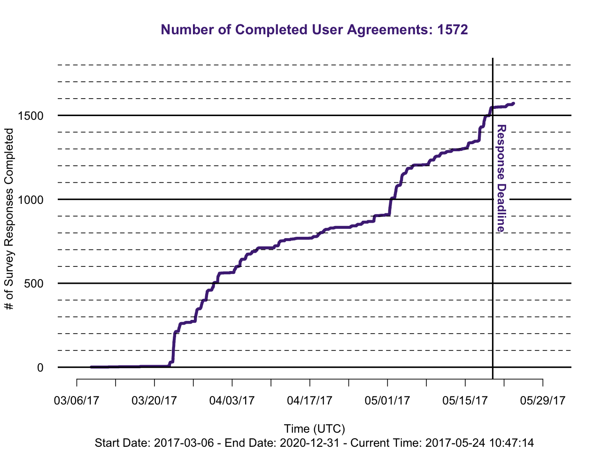

# Generic Survery Cumulative Response Curve

Notes:

* Sorts date times
* Removes `[not completed]` answers
* Requires a start and end boundary
* All timestamps outside the boundary are cropped out of the data
* Plotting starts at start date, ends at max value (not end boundary)

Example:

